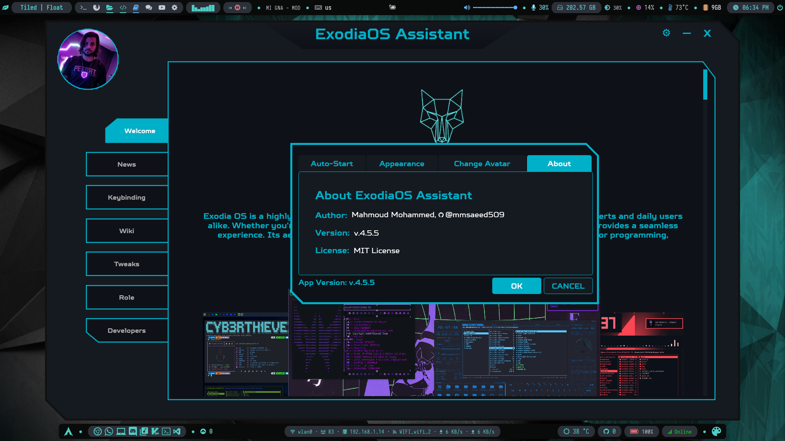

# Exodia OS Assistant App



## Description

Exodia Assistant is a comprehensive helper application for Exodia OS. It provides users with easy access to system information, documentation, keybindings, news updates, and more in an elegant, custom-shaped interface.

## Features

- **Welcome Screen**: Introduction to Exodia OS
- **News Updates**: Latest news and updates fetched from the Exodia OS repository
- **Keybinding Reference**: Searchable documentation for keyboard shortcuts
- **Wiki**: Searchable knowledge base for Exodia OS
- **Settings**: System configuration options
- **Developers**: Information about the Exodia OS development team
- **Custom UI**: Elegant, modern interface with custom-shaped window

## Installation

### From Package Manager (Recommended)

```bash
sudo pacman -S exodia-assistant
```

### Manual Installation

1. Clone the repository:
   ```bash
   git clone https://github.com/Exodia-OS/exodia-apps.git
   cd exodia-apps/exodia-assistant-app
   ```

2. Install dependencies:
   ```bash
   sudo pacman -S python-xlib exodia-pip-venv python-pyqt5
   ```

3. Build and install:
   ```bash
   cd src
   makepkg -si
   ```

## Usage

Launch the application from your application menu or run:

```bash
exodia-assistant
```

Navigate through the different sections using the side panel buttons. Use the search functionality in the Keybinding and Wiki sections to quickly find information.

## Contributing

- Fork the repo
- Install the dependencies
  ```bash
  cd src/files/exodia-assistant/
  pip install -r requirements.txt 
  ```
- Create a new branch with your **_username_** `dev-${GITHUB-USERNAME}` name (e.g. `dev-mmsaeed509`)
  ```bash
  git checkout -b dev-mmsaeed509
  ```
- Commit your changes
  ```bash
  ./git-push.sh -m "your commit msg"
  ```
- Create a pull request

## License

This project is licensed under the GPL3 License—see the LICENSE file for details.

## Developers

- **Maintainer**: Mahmoud Mohamed (00xWolf) - [GitHub](https://github.com/mmsaeed509)

### AI wrote 60% of this code.

- [Junie AI](https://www.jetbrains.com/junie)
- [Cursor AI](https://www.cursor.com)
- [DeepSeek](https://chat.deepseek.com)
- [KimiAI](https://kimi.moonshot.cn)
- [ChatGPT](https://chatgpt.com)
