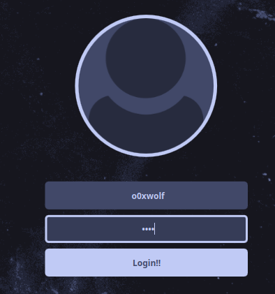

# To Do

- add Dashboard Tap
- button Setting
  - selectable and copyable text [✔]
  - add Logs
  - add search in `Fix & Tips`
  
- update Tips
  - PGP signature Error
  - Adding Music
  - Set keyboard Layout
  - Changing SDDM user picture
  - Create Your Own Theme
  - setup custom monitors config
  - setup Polybar Modules
  
- update Setting
  - create themes
  - change appearance
  - Install Themes (official and community)
  - fix bugs
  - Change Profile Photo
    - 
  - change sddm Profile Photo
    - 

___

- Background, Themes, Icons: Customize your visual experience effortlessly.
- Polybar: Easily configure your Polybar settings.
- RGB Keyboard: Control RGB settings for Predator Edition laptops.
- Picom Config: Tailor your Picom configuration.
- Keybinding: Set and modify keybindings easily.
- BSPWM Configurations: Manage BSPWM configurations and appearance settings.
- Auto-Start: Automatically start Exodia Assistant on boot.
- Auto-Update: Keep your BSPWM configuration up to date with Exodia OS repositories.
- And More: Stay tuned for additional features!  