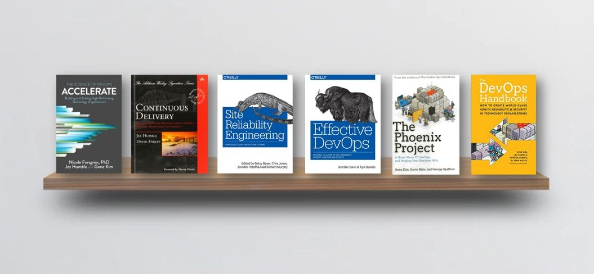

### Udemy Courses

- DevOps
  - [DevOps Beginners to Advanced with Projects](https://www.udemy.com/course/decodingdevops)
  - [Docker & Kubernetes: The Practical Guide](https://www.udemy.com/course/docker-kubernetes-the-practical-guide)
  - [Podman](https://www.youtube.com/watch?v=YXfA5O5Mr18&ab_channel=AmadeusforDevelopers)
  - [Kubernetes for the Absolute Beginners - Hands-on](https://www.udemy.com/course/learn-kubernetes/)
  - [Certified Kubernetes Administrator (CKA) with Practice Tests](https://www.udemy.com/course/certified-kubernetes-administrator-with-practice-tests)
  - [Kubernetes Certified Application Developer (CKAD) with Tests](https://www.udemy.com/course/certified-kubernetes-application-developer)
  - [HashiCorp Certified: Terraform Associate](https://www.udemy.com/course/terraform-beginner-to-advanced)
  - [Helm Masterclass: 50 Practical Demos for Kubernetes DevOps](https://www.udemy.com/course/helm-masterclass-50-practical-demos-for-kubernetes-devops)
  - [Microsoft Azure From Zero to Hero - The Complete Guide](https://www.udemy.com/course/microsoft-azure-from-zero-to-hero-the-complete-guide)
  - [OpenShift for the Absolute Beginners - Hands-on](https://www.udemy.com/course/learn-openshift)
  - [Google Kubernetes Engine GKE with DevOps 75 Real-World Demos](https://www.udemy.com/course/gcp-google-kubernetes-engine-gke-with-devops)
  - [Grafana](https://youtu.be/w-c3KYKQQfs?si=WvQt55G12T5t0-WQ)
  - [Azure Devops Crash Course -Build CI-CD release pipelines](https://www.udemy.com/course/azure-devops-fundamental)

- CI/CD
  - [Jenkins: From DevOps Beginners to Advanced](https://www.udemy.com/course/decodingdevops)
  - [GitHub Actions - The Complete Guide](https://www.udemy.com/course/github-actions-the-complete-guide)
  - [GitLab CI/CD: Pipelines, CI/CD and DevOps for Beginners](https://www.udemy.com/course/gitlab-ci-pipelines-ci-cd-and-devops-for-beginners)
  - [Azure Devops Crash Course -Build CI-CD release pipelines](https://www.udemy.com/course/azure-devops-fundamental)
  - [GitLab CI - A Complete Hands-On for CI/CD Pipelines & DevOps](https://www.udemy.com/course/gitlab-cicd-course)

---

### 1. GIT

- [Pro Git Book](https://git-scm.com/book/en/v2) FREE
- [Learn Git by Atlassian](https://www.atlassian.com/git) FREE
- [Learn Git Branching](https://learngitbranching.js.org/) FREE
- [Learn Git & GitHub on CodeAcademy](https://www.codecademy.com/learn/learn-git) FREE
- [Git Command Explorer](https://gitexplorer.com/) FREE
- [Git Immersion](https://gitimmersion.com/index.html) FREE
- [A Visual Git Reference](http://marklodato.github.io/visual-git-guide/index-en.html) FREE

### 2. Learn one programming language

- [Automate the Boring Stuff with Python book](https://automatetheboringstuff.com/) FREE
- [Python Crash Course](https://ehmatthes.github.io/pcc/) FREE
- [The Modern JavaScript Tutorial](https://javascript.info/) FREE
- [JavaScript Crash Course For Beginners](https://www.youtube.com/watch?v=hdI2bqOjy3c) FREE
- [Eloquent JavaScript, 3rd edition](https://eloquentjavascript.net/), Marjin Haverbeke FREE book
- [Go by Example](https://gobyexample.com/) FREE

### 3. Learn Linux & Scripting

- [Operating System - Overview](https://www.tutorialspoint.com/operating_system/os_overview.htm) FREE
- [Shell Scripting Tutorial](https://www.shellscript.sh/) FREE
- [Powershell Tutorial for Beginners: Learn Powershell Scripting](https://www.guru99.com/powershell-tutorial.html)  FREE
- [Bash Reference Manual](https://www.gnu.org/savannah-checkouts/gnu/bash/manual/bash.html) FREE
- [Ultimate Guide: Getting Started With Ubuntu](https://itsfoss.com/getting-started-with-ubuntu/) FREE
- [FreeBSD Handbook](https://docs.freebsd.org/en/books/handbook/) FREE
- [Linux command handbook](https://www.freecodecamp.org/news/the-linux-commands-handbook/) FREE

### 4. Learn Networking & Security

- [OSI Model Explained](https://www.cloudflare.com/en-gb/learning/ddos/glossary/open-systems-interconnection-model-osi/) FREE
- [Computer Networking: A Top-Down Approach](https://www.amazon.com/Computer-Networking-Top-Down-Approach-7th/dp/0133594149) book
- [TCP/IP and Networking Fundamentals for IT Pros](https://www.pluralsight.com/courses/tcpip-networking-it-pros) Pluralsight course
- [DevSecOps : Master Securing CI/CD | DevOps Pipeline](https://www.udemy.com/course/devsecops/) Udemy course
- [Hands-On Security in DevOps: Ensure continuous security, deployment, and delivery with DevSecOps](https://www.amazon.com/Hands-Security-DevOps-continuous-deployment/dp/1788995503)  Book
- [Securing DevOps: Security in the Cloud](https://www.amazon.com/Securing-DevOps-Security-Julien-Vehent/dp/1617294136/)  Book

### 5. Learn Server Management

- [What is a reverse proxy?](https://www.cloudflare.com/en-gb/learning/cdn/glossary/reverse-proxy/) FREE
- [Cache Server](https://networkencyclopedia.com/cache-server/) FREE
- [Reverse Proxy vs. Forward Proxy: The Differences](https://oxylabs.io/blog/reverse-proxy-vs-forward-proxy) FREE
- [What is load balancing?](https://www.cloudflare.com/en-gb/learning/performance/what-is-load-balancing/) FREE
- [What is a Firewall?](https://www.checkpoint.com/cyber-hub/network-security/what-is-firewall/) FREE
- [The NGINX Handbook](https://www.freecodecamp.org/news/the-nginx-handbook/) FREE
- [Learn Apache Server](https://www.twaino.com/en/blog/website-creation/apache-server-2/) FREE
- [Learn IIS](https://www.dnsstuff.com/windows-iis-server-tools) FREE

### 6. Learn Containers

- [What are Containers?](https://cloud.google.com/learn/what-are-containers) FREE
- [Learning Containers From The Bottom Up](https://iximiuz.com/en/posts/container-learning-path/) FREE
- [Docker Tutorial for Beginners by TechWorld with Nana](https://www.youtube.com/watch?v=3c-iBn73dDE) FREE
- [Docker Mastery: with Kubernetes +Swarm from a Docker Captain](https://www.udemy.com/course/docker-mastery/) Udemy course
- [What is Service Mesh?](https://www.redhat.com/en/topics/microservices/what-is-a-service-mesh) FREE

### 7. Learn Container Orchestration

- [Kubernetes Crash Course for Absolute Beginners by TechWorld with Nana](https://www.youtube.com/watch?v=s_o8dwzRlu4) FREE
- [Primer: How Kubernetes Came to Be, What It Is, and Why You Should Care](https://thenewstack.io/primer-how-kubernetes-came-to-be-what-it-is-and-why-you-should-care/) Article
- [Certified Kubernetes Administrator (CKA) with Practice Tests](https://www.udemy.com/course/certified-kubernetes-administrator-with-practice-tests/) Udemy course
- [Learn Kubernetes - Beginners to Advanced by KodeKloud](https://kodekloud.com/learning-path-kubernetes/) Course
- [Understand when to use Cluster Services, Ingresses or API Gateways](https://gateway-api.sigs.k8s.io) FREE
- [Understand which Problems Service Mesh solve (Use an Abstraction smi-spec.io](https://linkerd.io/2.12/features/) FREE
- [Learn how to automate TLS](https://cert-manager.io/docs/) and  [DNS](https://github.com/kubernetes-sigs/external-dns) FREE
- [Kubernetes Up and Running](https://www.amazon.com/_/dp/1491935677?tag=oreilly20-20) Book
- [Kubernetes Learning Path - 50 days from zero to hero from Microsoft](https://azure.microsoft.com/en-us/resources/kubernetes-learning-path/) FREE

### 8. Learn Infrastructure as a code

- [GUIs, CLI, APIs: Learn Basic Terms of Infrastructure-as-Code](https://thenewstack.io/guis-cli-apis-learn-basic-terms-of-infrastructure-as-code/) FREE
- [Official Terraform Tutorials](https://learn.hashicorp.com/terraform) FREE
- [A Comprehensive Guide to Terraform](https://blog.gruntwork.io/a-comprehensive-guide-to-terraform-b3d32832baca) FREE
- [Automate Terraform documentation like a pro!](https://medium.com/google-cloud/automate-terraform-documentation-like-a-pro-ed3e19998808) FREE
- [Writing reusable Terraform modules](https://thomasthornton.cloud/2022/06/02/writing-reusable-terraform-modules/) FREE
- [What is Istio?](https://www.redhat.com/en/topics/microservices/what-is-istio) FREE
- [Puppet overview](https://puppet.com/docs/puppet/latest/puppet_overview.html) FREE
- [Puppet Courses](https://training.puppet.com/) FREE and PAID
- [Getting Started With Ansible](https://docs.ansible.com/ansible/latest/getting_started/) FREE
- [Learning Ansible Basics](https://www.redhat.com/en/topics/automation/learning-ansible-tutorial)
- [Get started with Red Hat Ansible](https://www.ansible.com/resources/get-started) FREE and PAID
- [Mastering Ansible](https://www.udemy.com/course/mastering-ansible/) Udemy Course
- [Learn Chef](https://learn.chef.io/) FREE

### 9. Learn CI/CD

- [Continuous Integration](https://martinfowler.com/articles/continuousIntegration.html) FREE
- [CI/CD Pipeline: A Gentle Introduction](https://semaphoreci.com/blog/cicd-pipeline) FREE
- [Learn GitLab with tutorials](https://docs.gitlab.com/ee/tutorials/) FREE
- [Get started with GitLab CI/CD](https://docs.gitlab.com/ee/ci/quick_start/) FREE
- [Jenkins, From Zero To Hero: Become a DevOps Jenkins Master](https://www.udemy.com/course/jenkins-from-zero-to-hero) Udemy course
- [Learn GitHub actions](https://learn.microsoft.com/en-us/users/githubtraining/collections/n5p4a5z7keznp5) FREE
- [Workflow syntax for GitHub Actions](https://docs.github.com/en/actions/using-workflows/workflow-syntax-for-github-actions) FREE
- [Learn Azure DevOps](https://milan.milanovic.org/post/ci-cd-with-azure-devops-yaml/) FREE
- [GitLab Cheatsheets](https://dev.to/jphi_baconnais/series/12928) FREE

### 10. Learn Monitoring & Observability

- [What Is Observability? Comprehensive Beginners Guide](https://devopscube.com/what-is-observability/) FREE
- [The Hows, Whys and Whats of Monitoring Microservices](https://thenewstack.io/the-hows-whys-and-whats-of-monitoring-microservices/) FREE
- [DevOps Monitoring](https://www.atlassian.com/devops/devops-tools/devops-monitoring) FREE
- [Applying Basic vs. Advanced Monitoring Techniques](https://thenewstack.io/applying-basic-vs-advanced-monitoring-techniques/) FREE
- [Learn Prometheus](https://prometheus.io/docs/tutorials/getting_started/) FREE
- [Learn Grafana](https://grafana.com/tutorials/) FREE
- [Elastic Stack](https://www.elastic.co/guide/index.html) FREE

### 11. Learn one Cloud provider

- [Exam AZ-900: Microsoft Azure Fundamentals](https://learn.microsoft.com/en-us/certifications/exams/az-900) FREE
- [Microsoft Azure Fundamentals Certification Course (AZ-900)](https://www.youtube.com/watch?v=NKEFWyqJ5XA) FREE
- [AZ-900 | Microsoft Azure Fundamentals Full Course, Free Practice Tests, Website and Study Guides](https://www.youtube.com/watch?v=NPEsD6n9A_I&list=PLGjZwEtPN7j-Q59JYso3L4_yoCjj2syrM) FREE
- [Ultimate AWS Certified Cloud Practitioner - 2022](https://www.udemy.com/course/aws-certified-cloud-practitioner-new) Udemy
- [AWS Developer by A Cloud Guru](https://acloudguru.com/learning-paths/aws-developer) Learning path

### 12. Learn Software Engineering Practices

- [What is Scrum?](https://www.atlassian.com/agile/scrum) FREE
- [Ways To Learn About Scrum](https://www.scrum.org/resources/ways-learn-about-scrum) FREE
- [Software Development Life Cycle (SDLC) Phases & Models](https://www.guru99.com/software-development-life-cycle-tutorial.html) FREE
- [The Beginner's Guide to Agile in Jira: Course description](https://university.atlassian.com/student/page/1117976-the-beginner-s-guide-to-agile-in-jira-course-description?sid_i=8) FREE
- [Learn SAFe](https://www.scaledagileframework.com/) FREE
- [Learn Automation Testing](https://blog.testproject.io/2020/03/26/automation-testing-for-beginners-ultimate-guide/) FREE
- [GitLab - Beginner's Guide to DevOps](https://page.gitlab.com/resources-ebook-beginners-guide-devops.html) FREE
- [Common SDLC Models](https://www.scaler.com/blog/software-development-life-cycle/#common-sdlc-models) FREE

## Additional resources

### Tools

- **Work Tracking**:** [Asana](https://asana.com/), [Monday](https://monday.com/), [Jira](https://www.atlassian.com/software/jira), [Trello](https://trello.com/), [Azure Boards](https://azure.microsoft.com/en-au/products/devops/boards/).
- **Source code control**: [Git](https://git-scm.com/), [Github](https://github.com/), [GitLab](https://about.gitlab.com/), [BitBucket](https://bitbucket.org/), [Azure DevOps](https://azure.microsoft.com/en-us/products/devops).
- **CI/CD**: [Jenkins](https://www.jenkins.io/), [Team City](https://www.jetbrains.com/teamcity/), [Github Actions](https://github.com/features/actions), [Travis CI](https://www.travis-ci.com/), [Bamboo](https://www.atlassian.com/software/bamboo), [Circle CI](https://circleci.com/), [Azure Pipelines](https://azure.microsoft.com/en-us/products/devops/pipelines/), [Octopus Deploy](https://octopus.com/), [Harness](https://www.harness.io/), [CloudBees CodeShip](https://www.cloudbees.com/products/codeship).
- **Source Code Analysis**: [SonarQube](https://www.sonarsource.com/products/sonarqube/), [Veracode](https://www.veracode.com/).
- **Artifact management**: [Artifactory](https://jfrog.com/artifactory/), [Docker Container Register](https://docs.docker.com/registry/), [npm](https://www.npmjs.com/), [Yarn](https://yarnpkg.com/), [NuGet](https://www.nuget.org/).
- **Configuration Management**: [Terraform](https://www.terraform.io/), [Ansible](https://www.ansible.com/), [Puppet](https://www.puppet.com/), [Chef](https://www.chef.io/).
- **Container orchestration**: [Docker](https://www.docker.com/), [Kubernetes](https://kubernetes.io/), [Red Hat OpenShift](https://www.redhat.com/en/technologies/cloud-computing/openshift).
- **Monitoring**: [Prometheus](https://prometheus.io/), [Grafana](https://grafana.com/), [Splunk](https://www.splunk.com/), [Dynatrace](https://www.dynatrace.com/), [Kibana](https://www.elastic.co/kibana/).

---

### Books

- **[The DevOps Handbook: How to Create World-Class Agility, Reliability, and Security in Technology Organizations](https://amzn.to/3IJPv0h)**, Gene Kim, Patrick Debois, John Willis, Jez Humble 

    The book introduces product development, quality assurance, IT operations, and information security. It is a great read for those who are new to DevOps or who want to learn more about how the various components of DevOps work together.

- **[Accelerate: The Science of Lean Software and DevOps: Building and Scaling High Performing Technology Organizations](https://amzn.to/3XRShoA)**, Nicole Forsgren, Jez Humble, Gene Kim 

    This book presents both the findings and the science behind measuring software delivery performance. For promoting DevOps to senior management, it's a fantastic tool.

- **[Continuous Delivery: Reliable Software Releases through Build, Test, and Deployment Automation ](https://amzn.to/3XRShoA)**, Jez Humble, David Farley 

    It introduces automated architecture management and data migration. Many of the deployment pipeline concepts that have since become standard were established in this book. Config as Code, build and deployment automation, and efficient testing techniques are covered in some technical detail. Its mostly technical book.

- **[Team Topologies: Organizing Business and Technology Teams for Fast Flow](https://amzn.to/3Zb83fl)**, Matthew Skelton, Manuel Pais

    The book talks about how to organize teams in a way that enables fast flow of value to customers. It provides a set of four fundamental team topologies: Stream-Aligned Teams, Enabling Teams, Complicated-Subsystem Teams, and Platform Teams, which can be combined and adapted to suit different organizational contexts. 

- **[Effective DevOps: Building a Culture of Collaboration, Affinity, and Tooling at Scale](https://amzn.to/3Za5aLH)**, Jennifer Davis, Ryn Daniels

    The book provides effective ways to improve team coordination. It shows how to break down information silos, monitor relationships, and repair misunderstandings that arise between and within teams in your organization.

- **[The Phoenix Project: A Novel about IT, DevOps, and Helping Your Business Win](https://amzn.to/3Z6VSQG)**, Gene Kim, Kevin Behr, George Spafford

    It is a classic novel about effectiveness and communications. IT work is like manufacturing plant work, and a system must be established to streamline the workflow. One of the best books out there.

- **[Site Reliability Engineering](https://sre.google/books/)**, Betsy Beyer, Chris Jones, Jennifer Petoff, Niall Richard Murphy 

    This book explains the whole life cycle of Google’s development, deployment, and monitoring, and how to manage the world’s biggest software systems (also known as SRE). Anyone who considers themselves to be more on the "Ops" end of the DevOps side or who wants to know how to strengthen the bonds between various Dev and Ops teams should read SRE.

---

### Additional Recourse (Optional)

- DataBase
  - [Fundamentals of Database Engineering](https://www.udemy.com/course/database-engines-crash-course)

---

- APIs
  - [API and Web Service Introduction](https://www.udemy.com/course/api-and-web-service-introduction)
  - [Introduction to REST APIs for Absolute Beginners](https://www.udemy.com/course/api-with-postman-for-absolute-beginners)

---

- Agile
  - [Agile Fundamentals: Including Scrum & Kanban](https://www.udemy.com/course/agile-fundamentals-scrum-kanban-scrumban/)
  - [Complete Agile Scrum Master Certification Training](https://www.udemy.com/course/complete-agile-scrum-master-training-exam-simulator/)
